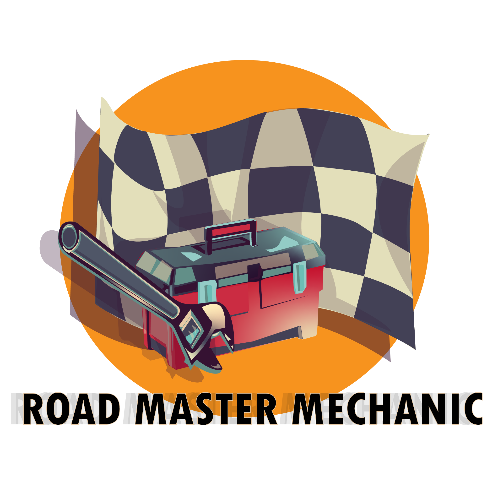

# Road Master Mechanic (IP)

Welcome to the world of **Road Master Mechanic**! Get ready to immerse yourself in the thrilling experience of car racing and car repair. 

Assigned by the Boss to mend cars, you're determined to become a top mechanic and racer. Scavenge parts in the Junkyard, earn money, buy better cars, and race at various tracks. Your journey begins with a wrench and a dream. Are you up for the challenge of becoming a master mechanic and a skilled car racer? Let's dive in!

## Concept

In **Road Master Mechanic**, you step into the shoes of a talented mechanic working at the prestigious Master Garage. Your ultimate goal is to rise through the ranks, mastering the art of car repair while also showcasing your racing prowess. This action-packed and casual PC game is tailored for car enthusiasts and young adult gamers, offering a unique blend of mechanical skill and racing excitement.

## Features

- **Repairing Cars**: Utilize the resources from the Junkyard to repair various cars brought into the Garage. Diagnose issues, replace parts, and restore vehicles to their former glory.

- **Customization**: Purchase and upgrade your own cars using the money earned from repairing cars. Enhance your vehicles' performance, speed, and aesthetics.

- **Thrilling Races**: Participate in exhilarating races at diverse racetracks. Use your racing skills to outmaneuver opponents and cross the finish line first.

- **Exploration**: Explore the vibrant city, visit the Dealership to acquire new cars, and scavenge the Junkyard for valuable parts.

## Gameplay

### Levels

1. **Garage**: Your home base where you repair cars and interact with NPCs. Upgrade your tools and skills here.

2. **Junkyard**: Scavenge for spare parts and materials to repair cars. Your resourcefulness will determine your success.

3. **City**: Navigate the city to access the Dealership for new car purchases and engage in side quests.

4. **Racetrack**: Showcase your racing prowess in high-speed races against AI opponents. Win races to earn reputation and rewards.

### Controls

#### Player Controls
- WASD: Move
- Space: Jump/continue convo
- Sprint: Shift
- Mouse Click: Interact
- E: Interact
- Esc: Open pause menu

#### Car Controls
- W: Accelerate
- S: Brake/Reverse
- A: Steer left
- D: Steer right
- Space: Handbrake
- Back Space: Get out of Car

### Desired Settings

- **Graphics Quality**: Performant/Balanced/High-fidelity.
- **Sound Volume**: Adjust the volume of in-game sounds and music.

### Limitations and Bugs

- The game may experience occasional frame drops on low-end systems during intense races.
- Randomized junk spawning in the Junkyard might sometimes lead to imbalanced repair opportunities.
- Some players have reported minor UI glitches when interacting with certain NPCs in the City.

### How to Win

To emerge as the ultimate **Road Master Mechanic**, follow these steps:

1. Master Car Repair: Hone your mechanical skills to efficiently diagnose and repair cars, earning reputation and money.
2. Upgrade Your Cars: Invest your earnings in purchasing and upgrading cars for superior racing performance.
3. Conquer Racetracks: Dominate races at various tracks, showcasing your racing prowess and earning the respect of fellow racers.
4. Earn the Title: Achieve the status of a master mechanic and a car racing champion by excelling in both fields.

## Credits

## Get Ready to Hit the Road!

**Road Master Mechanic** offers a one-of-a-kind gaming experience where car repair and racing collide. Are you prepared to take on the challenges of the garage and the racetrack? Get ready to prove your mettle as a true Road Master Mechanic!

## Screenshots

*Explore the vibrant city and prepare for intense races!*

*Master the art of car repair using scavenged parts.*

## Game Logo

*The iconic logo of Road Master Mechanic - where car repair meets racing excitement!*
